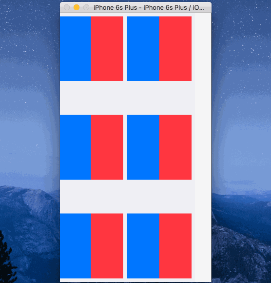

I'm having problems adjusting a cell's layout when the horizontal size class changes. I tried calling `collectionView.reloadData()` in `willTransitionToTraitCollection` then in `cellForItemAtIndexPath` i change the axis of a stackview depending on `traitCollection.horizontalSizeClass`. But not all cells update. See the gif below.

